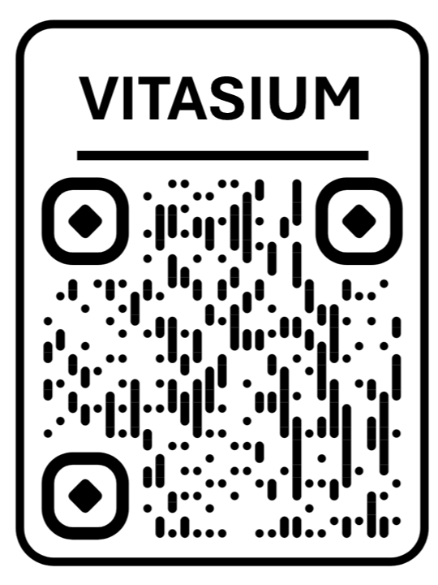

# Vitasium: AI-Driven Clinical Intelligence ⚡🩺⚡

<p align="center">
  
  
  
  
</p>

Vitasium is a high-fidelity **Retrieval-Augmented Generation (RAG)** ecosystem that delivers "Gold-Standard" medical information via WhatsApp and a Web Dashboard. It is specifically designed to combat health misinformation by grounding every response in verified clinical literature. 💡🏥

### These features make Vitasium unique:
* **Verified Knowledge** 💪: Grounded in *Oxford Handbook*, *IFRC*, and *Gale Encyclopedia*.
* **Multilingual Parity** 🆕: Seamless communication in 50+ languages (English, Tamil, Hindi, Spanish, etc.).
* **Emergency Triage** 📁: Instant detection of life-threatening symptoms with 112-link triggers.
* **Contextual Memory** 📁: AI remembers your medical history throughout the session.

---

## Technical Architecture 🚀

Vitasium is divided into specialized layers based on the modern AI stack:


| Layer | Component | Description |
| :--- | :--- | :--- |
| **Intelligence** | Llama-3.3-70B | High-speed reasoning via Groq LPU inference engine. |
| **Knowledge** | Pinecone Serverless | Vector database for sub-second clinical context retrieval. |
| **Embeddings** | Gemini-Embedding-001 | High-dimensional semantic mapping of medical context. |
| **Deployment** | Flask & Streamlit | Dual-channel interface for WhatsApp and Web Dashboard. |

---

## Project Structure 📁

```text
Vitasium_Project/
├── app.py                # Streamlit Dashboard UI (Glassmorphism)
├── whatsapp_bot.py       # Flask Server & Twilio WhatsApp Integration
├── vitasium_engine.py    # Core RAG Logic & AI Inference Engine
├── ingest_v2.py          # Multithreaded Knowledge Ingestor (Key Rotation)
├── medical_library/      # [Local Only] Curated Clinical PDFs
├── requirements.txt      # Project Dependencies
└── .env                  # API Keys & Configuration (Hidden)
```

## 🛠️ Installation & Setup

1. **Clone the repo:**

```bash
git clone https://github.com/your-username/vitasium.git

cd Vitasium_Project

```

2. **Install Dependencies:**

```bash
pip install -r requirements.txt

```

3. **Environment Variables:**
Create a .env file in the root directory and populate it with your keys: 👇

```env
GROQ_API_KEY=your_groq_key
PINECONE_API_KEY=your_pinecone_key
GOOGLE_API_KEY_1=your_google_key
GOOGLE_API_KEY_2=your_google_key
GOOGLE_API_KEY_3=your_google_key
GOOGLE_API_KEY_4=your_google_key
TWILIO_ACCOUNT_SID=your_sid
TWILIO_AUTH_TOKEN=your_token

```

## 📲 How to Interact with Vitasium

### 1. WhatsApp Assistant (Twilio Sandbox)

To access the medical assistant instantly on your phone:

* **Option A: Join through QR Code**
1. Scan the QR code
**
2. Send the default message typed already.
3. Once confirmed, type **"Hello"** to begin.
* **Option B: Manual Join** 
1. Save the number **+1 415 523 8886** to your contacts.
2. Send the message `join practical-more` to the number.
3. Once confirmed, type **"Hello"** to begin.

### 2. Clinical Dashboard (Web App)

For the professional web interface:

* **Live Link:** [Click here to launch Vitasium Web App](https://vitasium-ai-system-jr89kcivkkeappa3cezrxzn.streamlit.app/)

## ⚖️ Safety & Disclaimer

**Vitasium is an educational health awareness tool.** It is **not** a substitute for professional medical advice, diagnosis, or treatment. The system includes hard-coded emergency overrides that trigger when life-threatening symptoms are detected, directing users to immediate professional care.

## ⚡Plans for the future 
1. **Voice-to-Text:** Allow illiterate users to send WhatsApp voice notes for triage. 🎙️
2. **Vision RAG:** Integration with Gemini Vision for analyzing skin rashes or prescriptions. 📸